#  QuickLLaMA: Query-aware Inference Acceleration for Large Language Models

## Overview
We introduce Query-aware Inference for LLMs (Q-LLM), a system designed to process extensive sequences akin to human cognition. By focusing on memory data relevant to a given query, Q-LLM can accurately capture pertinent information within a fixed window size and provide precise answers to queries. It doesn't require extra training and can be seamlessly integrated with any LLMs. Q-LLM using LLaMA3 (QuickLLaMA) can read Harry Potter within 30s and accurately answer the questions. Q-LLM improved by 7.17% compared to the current state-of-the-art on LLaMA3, and by 3.26% on Mistral on the $\infty$-bench. In the Needle-in-a-Haystack task, On widely recognized benchmarks, Q-LLM improved upon the current SOTA by 7.0% on Mistral and achieves 100% on LLaMA3. 


## Usage
```python
from omegaconf import OmegaConf
from qllm.utils import patch_hf, GreedySearch, patch_model_center

# define your own tokenizer and model

# Use Q-LLM upon your model
conf = OmegaConf.load(config_path) # yamls in config
model = patch_hf(model, config.type, **config)

# the GreedySearch is for divding input sequence into chunks (8196)
model = GreedySearch(model, tokenizer)

# your own usage
# output = model.generate(input_ids) # support model.generate inputs

# clear the storage
model.clear()
```

The searcher also support vision-language models inputs, e.g., LLaVA-Next,
```python  
output = model.generate(
  input_ids,
  images=image_tensor, # also support images and image_sizes imput
  image_sizes=image_sizes,
)
```

## Config
```yaml
model: 
  type: qllm # attention type. 
  path: models/Mistral-7B-Instruct-v0.2 # huggingface or model-center model path
  fattn: false # Use flash-attention or not, we implemented multi-stage flash-attention by OpenAI's Triton.
  base: 1000000 # RoPE base
  distance_scale: 1.0 # RoPEdistance_scale

  # qllm/inf-llm/infinite-lm/stream-lm settings
  n_init: 128 # Initital tokens as attention sinks
  n_local: 4096 # Local sliding window size

  # qllm/inf-llm settings
  topk: 16 # Number of memory blocks to retrieve for attention computation.
  repr_topk: 4 # The number of top-scoring tokens per memory block considered as representative elements. 
  max_cached_block: 32 # Maximum number of memory blocks stored in GPU memory. 
  exc_block_size: 512 # Number of tokens queried at a time as an execution block. Each execution block retrieves topk memory blocks once.
  cache_strategy: lru # The strategy for replacing cached memory blocks. Supported strategies include LRU (Least Recently Used), FIFO (First In, First Out), and LRU-S (LRU in our paper).
  # score_decay: 0.1 # score_decay for LRU-S
  async_global_stream: false # Use overlap local and global calculation. Can accelerate, but may not be compatible.
  faiss: false # Use faiss for topk retrieval of memory units. It will increase inference time and ensure constant GPU memory usage.
  # perhead: false # Use perhead topk. Enabling it will be very time-consuming and is intended for research use only.

  # qllm settings
  question_weight: 1 # query weight

max_len: 2147483647 # Model max input length. A truncation will be employed if the input length exceeds.
truncation: suffix # truncation type. Now supports suffix only.
chunk_size: 8192 # Chunked input in decoding. To save GPU memory. (FFN block)
conv_type: mistral-inst # Conversation type. mistral-inst/vicuna/llama-3-inst/qwen/minicpm
```

## Benchmark
**Config**

The yamls in `config/` are parameters for evaluation. For example:
- **Mistral Q-LLM 512**: ```config=mistral-qllm-repr4-l256-bs64-topk4-w1```
- **Mistral InfLLM 512**: ```config=mistral-inf-llm-repr4-l256-bs64-topk4```
- **Mistral Stream-LLM 512**: ```config=mistral-stream-llm-512```
- **Mistral LM-Infinite 512**: ```config=mistral-infinite-lm-512```

**Models**
You can organize your models in this way:
```
- Q-LLM 
  - models
    - Mistral-7B-Instruct-v0.2
    - Meta-Llama-3-8B-Instruct
```

### LongBench/InfiniteBench
**Data Preparation**
```bash 
bash scripts/download.sh
```

**LongBench**
```bash
bash scripts/longbench.sh $config
```

**InfiniteBench**
```bash
bash scripts/infinitebench.sh $config
```

### Needle-in-a-Haystack
```bash
bash scripts/needle_in_a_haystack.sh $config
```

### Custom
```bash
bash scripts/custom.sh $config # feel free to add your custom datasets
```

## Examples
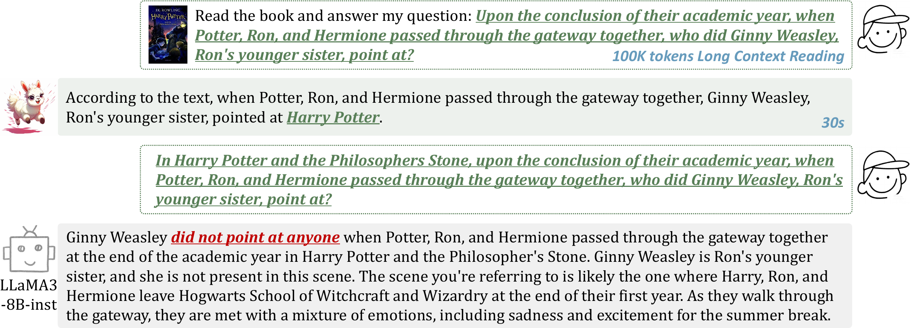 
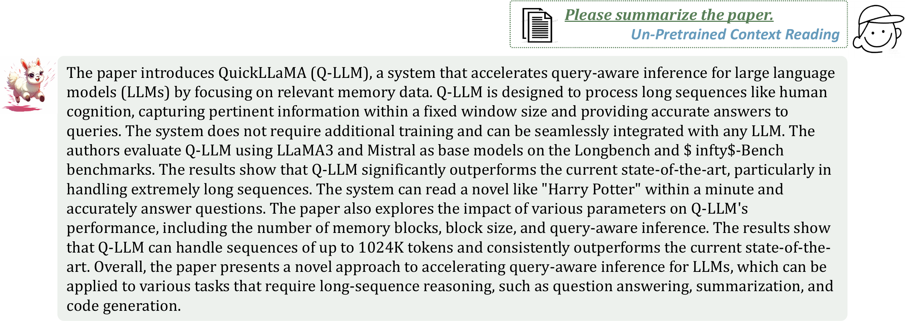
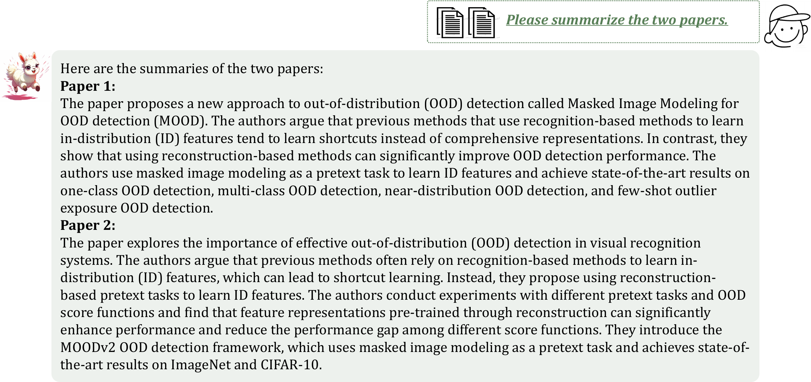 
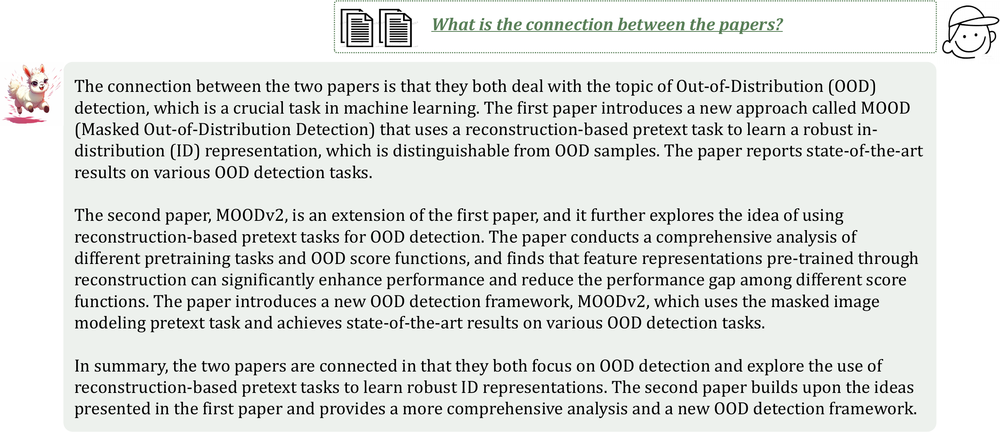 
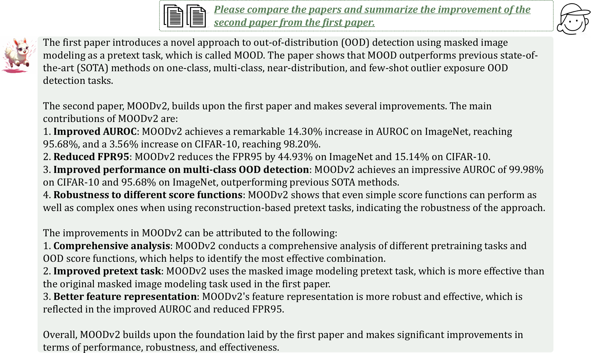 
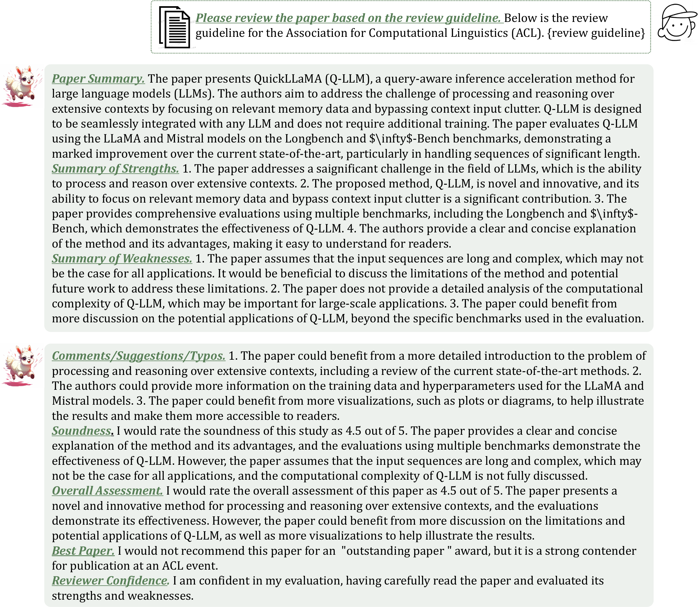 
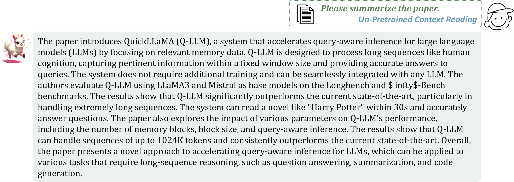 
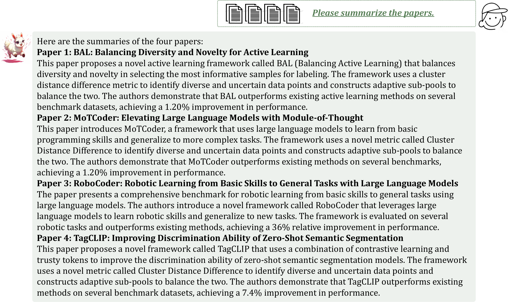 
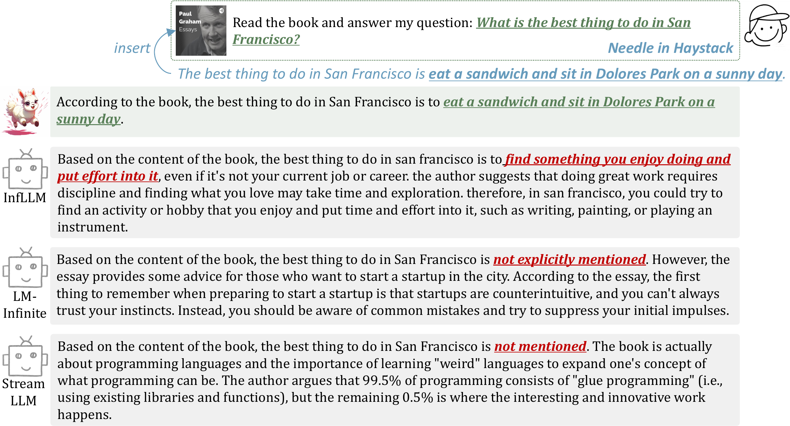 
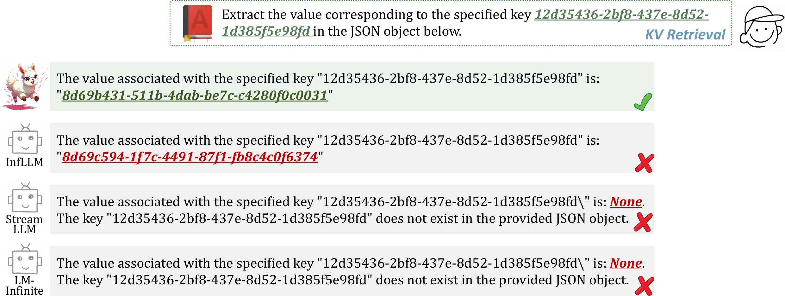 
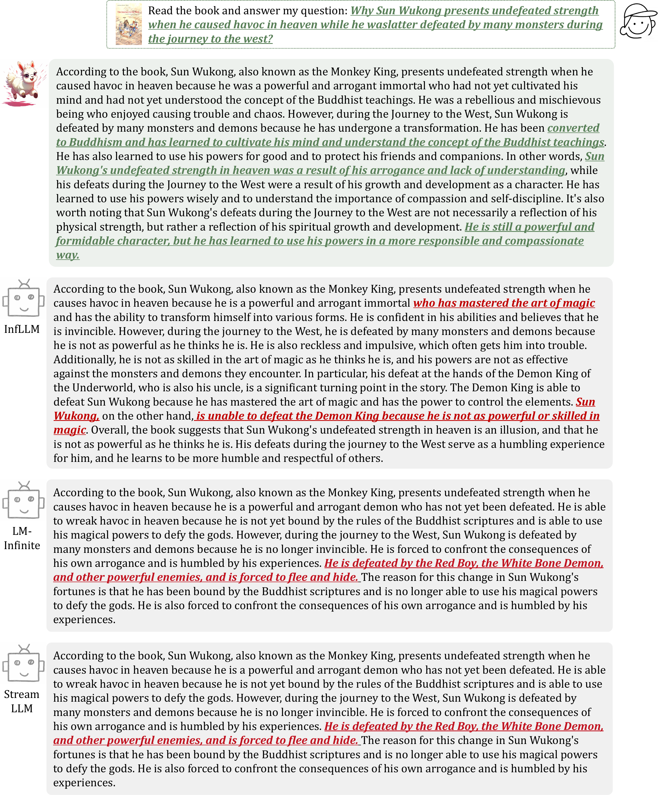 

## Acknowledgement
We thank the following repositories for reference:
- [NeedleInAHaystack](https://github.com/gkamradt/LLMTest_NeedleInAHaystack)
- [Long-Context-Data-Engineering](https://github.com/FranxYao/Long-Context-Data-Engineering)
- [Streaming-LLM](https://github.com/mit-han-lab/streaming-llm)
- [LM-Infinite](https://github.com/Glaciohound/LM-Infinite)
- [InfLLM](https://github.com/Glaciohound/LM-Infinite)

